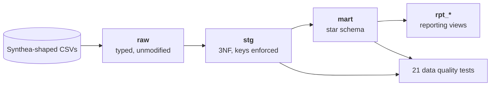
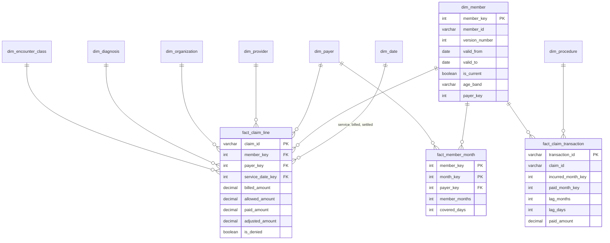

# Healthcare Claims Warehouse

A dimensional warehouse for healthcare claims, built end to end in SQL: raw ingestion, a third-normal-form staging layer, a Kimball star schema with a Type 2 member dimension, and a reporting layer that answers the questions a payer analytics team actually asks.

The headline piece is **claim lag**. Claims are incurred in one month and paid over the following several, so any recent month's paid total is incomplete. This project builds a development triangle, fits completion factors from fully developed months only, and uses them to estimate IBNR reserves. It then back-tests those estimates against what actually settled, because an estimate nobody checks is just a number.

Everything runs on DuckDB with no server, no cloud account and no credentials. Clone it and you have results in about a minute.

```bash
pip install -r requirements.txt
python generator/generate.py --out data/raw   # ~20s
python run.py --report                        # ~5s: build, test, print
```

---

## Why this problem

I work in Medicaid claims reporting. A large part of my job is answering questions from regulators about claims paid years ago: everything paid to a particular provider, or every claim tied to a specific dispute, sometimes reaching back a decade. I pull those from historical claims data in Athena.

That work taught me the hard part is almost never the query. It is that the answer has to be right about a moment in the past, and it has to be the same answer when someone asks again next year. Three things break that:

-  a provider or member whose details have changed since the claim was paid, attributed to who they are today rather than who they were on the service date
-  a paid total treated as final when later adjustments and reversals have moved it, so the same question asked twice returns two different numbers
-  a join that silently duplicates rows, which nobody catches until a total is reconciled against finance

This repository handles all three explicitly rather than assuming them away. The Type 2 member dimension keeps point-in-time attribution correct. Every figure is anchored to a stated valuation date, so a number can be reproduced as at a specific close. The reconciliation tests tie counts and dollars from raw through to both fact grains. That third one is not hypothetical: the reconciliation test in this repo caught exactly that bug during development, and the fix is commented in place at sql/02_marts/02_facts.sql.
```
---

## Data

The generator produces synthetic data that is **column-compatible with a [Synthea](https://github.com/synthetichealth/synthea) CSV export**. Drop a real Synthea export into `data/raw/` and everything downstream runs unchanged.

No real patient data is used anywhere in this project.

The generator is not a toy. It deliberately models the things the reporting layer needs in order to be meaningful:

| Property | Why it is there |
|---|---|
| Log-normal claim lag, longer for inpatient | Without a realistic lag distribution a development triangle has nothing to show |
| Denials (~8.5%) with reason codes | So denial analysis has something to analyze |
| Contractual adjustments | So billed, allowed and paid are three different numbers, as they are in reality |
| Enrollment spans with gaps and payer switches | The source of both member months and the Type 2 dimension |
| Medication fills with refill gaps | So PDC is not trivially 1.0 |

Default run: 2,500 members, three years (2023 to 2025), seeded and reproducible.

```
patients                2,500      claims                 39,828
payer_transitions       5,245      claims_transactions   116,144
encounters             39,828      medications            19,248
```

---

## Architecture



Four layers, each with one job.

**`raw`** mirrors the source exactly. Types are applied, nothing is renamed. This is what makes the Synthea swap possible.

**`stg`** is third normal form. Every entity gets one table, primary keys are declared and enforced by DuckDB, and reference data that arrived as repeated free text is lifted into lookup tables. The point of this layer is integrity, not speed: a duplicate in the source fails the build here, rather than silently doubling a measure three layers downstream.

**`mart`** is the Kimball star. Integer surrogate keys, conformed dimensions, and an unknown member at key `-1` so facts never drop rows or leave nulls.

**`rpt_*`** are the reporting views. Each is documented with the reasoning behind the calculation, not just the calculation.

---

## The star schema



**Three facts at three grains**, because the questions need them:

| Fact | Grain | Rows | What it is for |
|---|---|---|---|
| `fact_claim_transaction` | one financial transaction | 116,144 | The only place lag can be measured honestly, because it keeps service date and post date apart |
| `fact_claim_line` | one claim | 39,828 | What most reporting reads |
| `fact_member_month` | member × month | 144,310 | Periodic snapshot. The denominator for PMPM |

**`dim_member` is a Type 2 slowly changing dimension.** A new version opens whenever coverage changes, which here means a payer switch or a break in enrollment. Facts join on the version in effect on the service date, so a claim incurred under last year's plan stays attributed to that plan after the member moves. 2,500 members produce 5,246 versions. `valid_to` on the current row is `9999-12-31` rather than null, so `BETWEEN` works without a `COALESCE` in every join.

---

## Results

All figures below are from an actual run, not illustrations. Reproduce with `python run.py --report`.

### Claim lag by care setting

Inpatient claims take more than three times as long to settle as wellness visits, and the tail is what hurts: the 99th percentile inpatient claim pays 335 days after service.

| Setting | Payments | Mean lag | Median | P90 | P99 | Max |
|---|---:|---:|---:|---:|---:|---:|
| Inpatient | 1,808 | 66.2 | 49 | 126 | 335 | 420 |
| Emergency | 2,908 | 38.1 | 29 | 74 | 156 | 298 |
| Outpatient | 5,439 | 26.7 | 22 | 48 | 90 | 255 |
| Urgent care | 3,606 | 23.8 | 20 | 42 | 77 | 188 |
| Ambulatory | 16,865 | 21.2 | 18 | 37 | 65 | 139 |
| Wellness | 5,862 | 18.7 | 17 | 31 | 52 | 111 |

### Completion factors

Fitted on 24 fully developed incurred months, as at a valuation date of 2025-12-31.

| Months of development | 0 | 1 | 2 | 3 | 4 | 5 | 6 | 8 |
|---|---:|---:|---:|---:|---:|---:|---:|---:|
| Completion factor | 0.118 | 0.502 | 0.742 | 0.872 | 0.914 | 0.958 | 0.972 | 0.989 |

**Only 12% of a month's eventual cost has been paid by the end of that month.** Reporting a month's paid total as if it were final is not a small error, it is an order-of-magnitude one.

### IBNR reserve estimate

| Incurred month | Months developed | Paid to date | Completion factor | Estimated ultimate | IBNR reserve |
|---|---:|---:|---:|---:|---:|
| 2025-12 | 0 | 263,236 | 0.118 | 2,227,036 | **1,963,800** |
| 2025-11 | 1 | 1,257,844 | 0.502 | 2,505,165 | 1,247,322 |
| 2025-10 | 2 | 1,428,220 | 0.742 | 1,924,306 | 496,086 |
| 2025-09 | 3 | 1,897,278 | 0.872 | 2,175,279 | 278,001 |
| 2025-08 | 4 | 2,705,055 | 0.914 | 2,958,931 | 253,876 |

Total reserve carried across all incurred months: **$4.58M** against $89.7M paid to date.

### Back-test

Because this dataset is complete, the true ultimate is knowable. A production warehouse never has that luxury; a portfolio one should use it.

| | |
|---|---:|
| Immature months tested | 12 |
| Mean absolute error | **4.64%** |
| Net error across all 12 months | −3.26% |

The method is well behaved from two months of development onward (errors under 2%). The freshest month is the weakest, at −24%, which is the honest and expected result: estimating a month from 12% of its data is the hardest case, and any analyst presenting this should say so rather than quote a single accuracy number.

### PMPM, and why the denominator matters

2025, by payer. Members average roughly 10 covered months per year, not 12, because of enrollment gaps and mid-year switches.

| Payer | Member months | Distinct members | Avg months/member | PMPM (correct) | Per-member (naive) |
|---|---:|---:|---:|---:|---:|
| Pacific Blue Shield | 8,028 | 791 | 10.15 | **$1,228** | $12,465 |
| Cascadia Health Plan | 6,352 | 629 | 10.10 | **$1,153** | $11,648 |
| Northstar Mutual | 5,049 | 494 | 10.22 | **$1,099** | $11,231 |
| Federal Medicare | 4,052 | 410 | 9.88 | **$1,091** | $10,781 |
| State Medicaid | 5,556 | 546 | 10.18 | **$1,017** | $10,348 |

PMPM also rises monotonically with age, from $694 for members under 18 to $1,527 for members 80 and over, which is the sanity check that the exposure model is behaving.

### Cost concentration

| Cohort | Members | Paid | Share of total |
|---|---:|---:|---:|
| Top 1% | 25 | $7.07M | 7.4% |
| Top 5% | 100 | $18.44M | 19.3% |
| Bottom 50% | 1,213 | $4.26M | 4.5% |

### Medication adherence (PDC)

Proportion of Days Covered, 2025, across five maintenance drugs. Overlapping supply from early refills is counted once, not twice, which is the detail most hand-rolled PDC calculations get wrong.

| PDC band | Member-drug-years | Share |
|---|---:|---:|
| 0.90 – 1.00 (high) | 151 | 12.7% |
| 0.80 – 0.89 (adherent) | 266 | 22.4% |
| 0.60 – 0.79 (partial) | 518 | 43.6% |
| 0.40 – 0.59 (poor) | 223 | 18.8% |
| 0.00 – 0.39 (very poor) | 29 | 2.4% |

35% of member-drug-years clear the conventional 0.80 adherence threshold.

---

## Tests

21 tests, all of which must return zero rows. `python run.py` exits non-zero on any failure, so this drops into CI unchanged.

```
21/21 tests passed
```

Three kinds, and all three earn their place:

**Structural** — surrogate keys unique, every fact joins to a dimension, no claim falls through to the unknown member.

**Temporal** — Type 2 versions do not overlap, exactly one current version per member, no payment posts before its service date, no member month falls outside a coverage span.

**Reconciling** — claim counts and dollar totals tie from raw through staging to both fact grains. These are the tests that catch a wrong join, and during development they did: an early version of `fact_claim_line` joined claims to encounters on member and date, which fans out whenever a member has two encounters on one day. 780 claims silently duplicated and $3.9M of phantom billed charges appeared. Nothing about the report looked wrong. The reconciliation test failed immediately.

**Business rules** — a denied claim never carries a payment, allowed never exceeds billed, paid never exceeds allowed, PDC stays within 0 and 1, and completion factors never decrease with age.

---

## Layout

```
generator/generate.py          synthetic data, Synthea-compatible schema
sql/01_staging/01_raw.sql      typed landing
sql/01_staging/02_stg_3nf.sql  third normal form, keys enforced
sql/02_marts/01_dimensions.sql conformed dims, Type 2 member
sql/02_marts/02_facts.sql      three facts at three grains
sql/03_reporting/01_claim_lag.sql            triangle, completion factors, IBNR, back-test
sql/03_reporting/02_pmpm_and_utilization.sql PMPM, denials, concentration
sql/03_reporting/03_adherence.sql            PDC
tests/run_tests.py             21 data quality tests
run.py                         build + test + report
```

## Running it

```bash
make all      # generate data and build
make report   # build, test, print the reporting tables
make test     # tests only, against an existing build
```

To re-run the reserve analysis as at a different close, change `valuation_date` in `sql/03_reporting/01_claim_lag.sql`.

## Stack

DuckDB, SQL, Python. No warehouse account, no orchestration layer, no dependencies beyond `duckdb` and `pandas`. That is deliberate: the interesting part of this project is the modeling and the reasoning, and neither should be gated behind infrastructure a reader cannot stand up in a minute.
